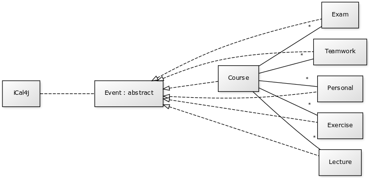
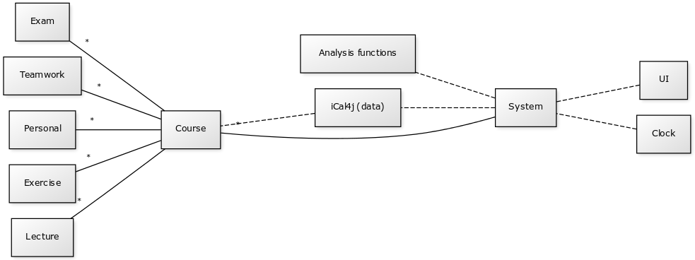

#Aihe
Ohjelman tarkoitus on toimia opiskelijan henkilökohtaisena apuvälineenä opiskelun työtaakan aikaseurannassa. Ensimmäisellä käyttökerralla opiskelija lukee ohjelmalla käynnissä olevat kurssinsa yliopiston kalenteritiedosta, tai täyttää ohjelmaan tiedot itse. Jatkossa opiskelija kirjaa kursseihin tehdyn työn sekä luennoille yms. osallistumisensa ohjelmaan.

Kurssikohtaisesti kerätään tiedot luennoista, laskuharjoituksista sekä muusta kurssin eteen tehdystä työstä (esim. pajatyöskentely tai itsenäinen työskentely). Itsenäistä työtä tehdessään käyttäjä voi kellottaa työskentelynsä ohjelmalla suoraan, tai syöttää aikatiedot erikseen jälkikäteen. Etukäteen aikataulutetun työn (luennot ja laskuharjoitukset) tapauksessa ohjelma voi esimerkiksi kysyä opiskelijalta kävikö tämä luennolla, jolloin vastauksesta riippuen aikaseurantaa päivitetään.

Varastoiduista seurantatiedoista opiskelija voi verrata kurssiin käyttämäänsä aikaa sen opintopistemäärän laskennolliseen työtaakkaan tai muihin suorittamiinsa kursseihin.

Kurssien työtaakasta voidaan luoda myös aggregaattimuuttujia ja katsoa opiskelijan kokonaistaakkaa jollain aikavälillä.

Ohjelma tallentaa kerätyt tiedot samassa iCalendar-formaatissa millä siihen voi tuoda tietoa ulkopuolelta

#Mahdollisia laajennuksia:
 - visuaalisia kuvaajia seurantatiedoista
 - ei kalenteritiedostoja, vaan suora lukeminen yliopiston kalenterista ja tallentaminen esim. google calendariin.
 
#Suunnitteluvaiheen luokkamallia, ja muutamia selvennyksiä kohdealueen mallintamisesta ohjelmassa
Ohjelman käyttämä datasäilö on yksinkertainen iCalendar-standardin mukainen kalenteritiedosto. Ohjelma ei siis käytä tietokantatauluja, vaan datan purkaminen ohjelman sovelluslogiikan olioiksi, sekä tallentaminen takaisin tallennuskerrokseen tapahtuu iCal4J-kirjaston toimintoja hyödyntäen. Kirjaston tarjoamat luokat toimivat pohjana ohjelmassa toteutetulle sovelluslogiikalle.

Ohjelman kohdealueesta muodostettu luokkamalli muodostuu rakenteesta, jossa abstrakti luokka Event kuvaa mitä tahansa kalenterimerkinnän pohjalta luotua oliota. Abstraktin luokan toteuttaa kohdealueelta määritellyt luokat, ja mallin yhteenkokoajana toimii luokka Course, johon muut kalenterimerkinnät liittyvät. Huomioitavaa on, että myös Course on Event-luokan toteutus.

Event-luokka itsessään on jatke iCal4j-kirjaston tarjoamalle kalenterimerkintäluokalle, jonka toiminnallisuutta on tässä jatkettu ohjelman vaatimuksien mukaisiksi. 

#Perustelut mallin rakenteelle

Datan keruu kalenteritiedostosta tapahtuu kirjaston tarjoamin toiminnallisuuksin, mutta synnytetyt oliot tarjoavat suoraan ohjelmalogiikan tarvitsemia toimintoja. Koska kaikki merkintäoliot nivoutuvat takaisin yhteen iCal4j-kirjaston tarjoamaan kalenterimerkintäluokkaan, ei tallennustoimenpiteissä tarvitse suorittaa enää muutoksia, vaan kalenteritiedosto rakentuu suoraan sovelluslogiikan olioista iCal4j-kirjaston tarjoamin toiminnoin. 

Ohjelmalogiikan toiminnan edellyttämät liitokset merkintöjen välillä (luokkien toistensa tunteminen) tapahtuu sijoittamalla kalenterimerkintöihin tallennusvaiheessa identifoivia kenttiä, joiden perusta on ohjelmalogiikassa tapahtuneissa toiminnoissa. Käytetyt kentät ovat iCalendar-standardin mukaisia, ja sopivat käyttökohteeseensa.

#Hahmotelmaa ohjelmalogiikan toimintojen ja teknisten luokkien liittymisestä kohdealueen malliin
Seuraavassa tarkempi hahmotelma ohjelman muiden toimintojen suhtautumisesta edellä esitettyyn kohdealueen luokkamalliin. System on tässä yleinen ohjelmalogiikkan edustaja, samoin kuin esimerkiksi ”Analysis functions” kuvaa kokonaisuudessaan ohjelman analyysiluokkia. 

