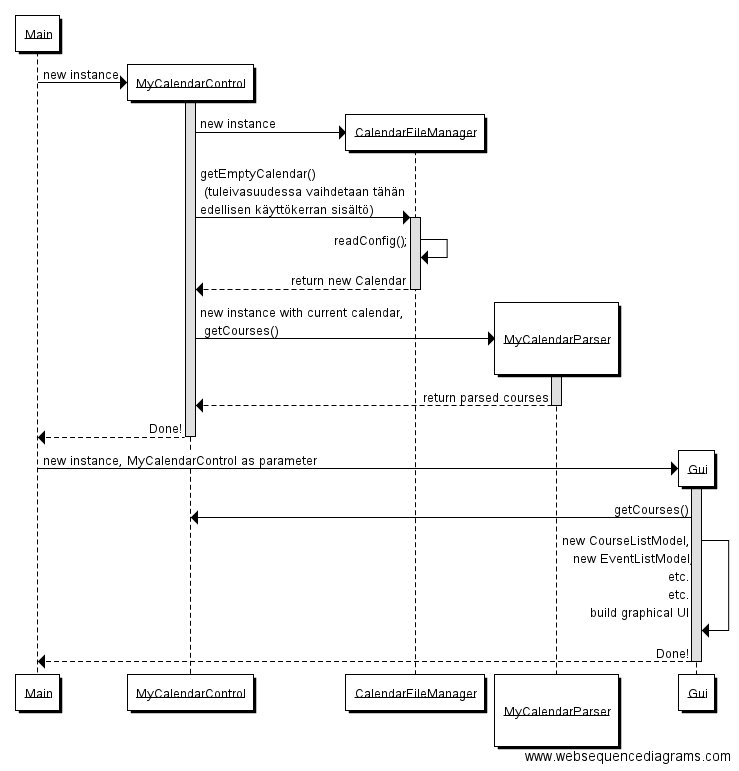
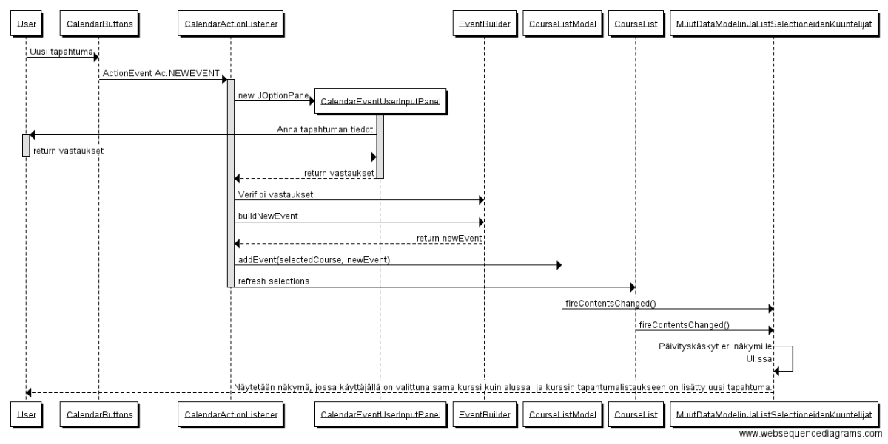

#Aihe
Ohjelman tarkoitus on toimia opiskelijan henkilökohtaisena apuvälineenä opiskelun työtaakan aikaseurannassa. Ensimmäisellä käyttökerralla opiskelija lukee ohjelmalla käynnissä olevat kurssinsa yliopiston kalenteritiedosta, tai täyttää ohjelmaan tiedot itse. Jatkossa opiskelija kirjaa kursseihin tehdyn työn sekä luennoille yms. osallistumisensa ohjelmaan.

Kurssikohtaisesti kerätään tiedot luennoista, laskuharjoituksista, omasta työskentelystä, tiimityöskentelystä sekä kokeista.

Varastoiduista seurantatiedoista opiskelija voi verrata kurssiin käyttämäänsä aikaa muihin suorittamiinsa kursseihin.

Kurssien työtaakasta voidaan luoda myös aggregaattimuuttujia ja katsoa opiskelijan kokonaistaakkaa jollain aikavälillä.

Koska ohjelma tallentaa kerätyt tiedot samassa iCalendar-formaatissa millä siihen voi tuoda tietoa ulkopuolelta, on kaikki ohjelmalla kerätyt tiedot ladattavissa uudestaan mihin tahansa kalenteriohjelmaan. Näin opiskelija voi seurata historiallista työtaakkaansa myös haluamallaan tutulla kalenterilla, mutta myös aikatauluttaa itselleen valmiiksi tulevia työtaakkoja; esim. "Perjantai 23.9. klo 17-19, kirjoita testejä".

Linkin takana havainnoillistus (vielä pelkällä yliopiston kalenteridatalla, ei omia merkintöjä) muutosta kalenteridatassa ennen ja jälkeen ohjelman käsittelyn.

[Kalenteridatan muutokset](kalenteriesimerkki.md)

##Mahdollisia laajennuksia:
 - visuaalisia kuvaajia seurantatiedoista
 - ei kalenteritiedostoja, vaan suora lukeminen yliopiston kalenterista ja tallentaminen esim. google calendariin.
 - opintopisteet mukaan statseihin
 
##Hylättyjä ominaisuuksia
 - työajan kellotus itse ohjelmalla hylättiin, koska ohjelman ydinajatukseksi muotoutui kalenterimerkintöjen muokkaus.
 
##Hienoja uusia ominaisuuksia, joita tuli toteutettua
 - Tapahtumien importtaus toimii älykkäästi. Jos importtaa uudestaan saman kurssin sisällön, ei uutta kurssia lisätä, vaan tarkistetaan onko uudessa importissa sellaisia tapahtumia mitä aiemmin ei olla tuotu ohjelmaan. Vain nämä tapahtumat lisätään jo olemassa olevaan kurssiin ohjelmassa. Tämän pohjalta pitäisi jatkossakin olla helppoa käyttää ohjelmaa yli periodien, tai toteuttaa tuo Online-luku suoraan yliopiston kalenteritiedostosta.
 
##Malli ja muutamia selvennyksiä kohdealueen mallintamisesta ohjelmassa
Ohjelman käyttämä datasäilö on yksinkertainen iCalendar-standardin mukainen kalenteritiedosto. Ohjelma ei siis käytä tietokantatauluja, vaan datan purkaminen ohjelman sovelluslogiikan olioiksi, sekä tallentaminen takaisin tallennuskerrokseen tapahtuu iCal4J-kirjaston toimintoja hyödyntäen. Kirjaston tarjoamat luokat toimivat pohjana ohjelmassa toteutetulle sovelluslogiikalle.

Ohjelman kohdealueesta muodostettu luokkamalli muodostuu rakenteesta, jossa abstrakti luokka Event kuvaa mitä tahansa kalenterimerkinnän pohjalta luotua oliota. Abstraktin luokan toteuttaa kohdealueelta määritellyt luokat, ja mallin yhteenkokoajana toimii luokka Course, johon muut kalenterimerkinnät liittyvät. Huomioitavaa on, että myös Course on Event-luokan toteutus.

Event-luokka itsessään on jatke iCal4j-kirjaston tarjoamalle kalenterimerkintäluokalle, jonka toiminnallisuutta on tässä jatkettu ohjelman vaatimuksien mukaisiksi. 

##Perustelut mallin rakenteelle

Datan keruu kalenteritiedostosta tapahtuu kirjaston tarjoamin toiminnallisuuksin, mutta synnytetyt oliot tarjoavat suoraan ohjelmalogiikan tarvitsemia toimintoja. Koska kaikki merkintäoliot nivoutuvat takaisin yhteen iCal4j-kirjaston tarjoamaan kalenterimerkintäluokkaan, ei tallennustoimenpiteissä tarvitse suorittaa enää muutoksia, vaan kalenteritiedosto rakentuu suoraan sovelluslogiikan olioista iCal4j-kirjaston tarjoamin toiminnoin. 

Ohjelmalogiikan toiminnan edellyttämät liitokset merkintöjen välillä (luokkien toistensa tunteminen) tapahtuu sijoittamalla kalenterimerkintöihin tallennusvaiheessa identifoivia kenttiä, joiden perusta on ohjelmalogiikassa tapahtuneissa toiminnoissa. Käytetyt kentät ovat iCalendar-standardin mukaisia, ja sopivat käyttökohteeseensa.

##Hahmotelmaa ohjelmalogiikan toimintojen ja teknisten luokkien liittymisestä kohdealueen malliin
Seuraavassa tarkempi hahmotelma ohjelman muiden toimintojen suhtautumisesta edellä esitettyyn kohdealueen luokkamalliin. System on tässä yleinen ohjelmalogiikkan edustaja, samoin kuin esimerkiksi ”Analysis functions” kuvaa kokonaisuudessaan ohjelman analyysiluokkia. 

## Uusi luokkakaavio, sekvenssikaavioita ja ohjelman lopullisen rakenteen avausta

## Rakennekuvaus
Ohjelma on lähes valmistunut. Yllä näkyvässä luokkakaaviossa on pääosin kuvattu merkittävät tuntemissuhteet ohjelman sisällä. Kaavioon piirrettyjen luokkien lisäksi graafinen käyttöliittymä rakentuu useista muistakin komponenteista, ja ohjelmassa on lisäksi utils-pakkauksen alla useita apuvälineluokkia ja lueteltuja tyyppejä. 

Ohjelman käynnistyksen yhteydessä luodaan MyCalendarControl, joka toimii ohjelman ytimessä sovelluslogiikan ja käyttöliittymän välissä. Se tarjoilee kunakin ajanhetkenä käytössä olevan kalenterin sisällön käyttöliittymälle CourseListModel-luokan sisältönä (lista kursseja): ensin käynnistyksen yhteydessä GUI:n komponenttien rakentamisen osana, ja myöhemmin käyttäjän tehdessä muutoksia MainMenuActionListenerin toiminnoilla. MyCalendarControl, kuten mikään muukaan sovelluslogiikan luokka ei tunne niiden käyttäjiä GUI:n puolella mitenkään. GUI:n komponentit tuntevat käyttäjän valitsemia kursseja ja tapahtumia (jotka saatu CourseListModelista), jonka lisäksi jotkin osat GUI:ta käyttävät utils-paketin apuvälineitä. 

MyCalendarControl saa kurssit joko avaamalla kalenteritiedoston CalendarFilemanagerin kautta suoraan käyttöön parsimalla sen MyCalendarParserilla, tai käyttäjän valitessa Import-toiminnon, jolloin kalenteritiedoston sisältö parsitaan CalendarImportManager, CalendarImportParser ja CalendarImportBuilder luokkien toimintoina. Ohjelma tallentaa täysin standardinmukaiseen ics-kalenteritiedostoon, jonka voi ladata mihin tahansa kalenteriohjelmaan katseltavaksi. Jotta käyttäjän luoma rakenne säilyisi, hyväksikäytetään tallennuksessa kalenterimerkintöjen kenttiä luovasti. Kalenteritiedoston luku olioiksi ja olioiden tallennus takaisin kokonaiseksi kalenteriksi tapahtuvat ical4j-kirjaston toiminnoilla.

Graafisen käyttöliittymän rakentaminen ja suunnittelu tuntui todella vaikealta, ja aikaa upposi hirmuiset määrät edes nykyisen kaltaisen selvyyden saavuttamiseen rakenteessa. Kunhan pienen tauon jälkeen jaksan palata ohjelman pariin, siitä voisi refaktoroida koko Lecture, Exercise jne. luokkarakenteen pois. Luokista tuli loppujenlopuksi täysin toimettomia, ja ne toimivat vain identifikaattoreilla eri tapahtumatyypeille. Tämä onnistuisi kuitenkin paljon paremmin attribuuttina yhdessä luokassa, jolloin utils-paketin kovassa käytössä oleva Enum EventType tulisi vielä hyödyllisemmäksi. 

Sekvenssikaavio ohjelman käynnistyksestä:

Sekvenssikaavio uuden tapahtuman lisäämisestä kurssiin:

## Käyttöohje
Pääasiassa ohjelman käyttö on toivottavasti itsestäänselvää.

Tiedostolla readymadecalendar.ics voi testata valmista ohjelman omaa formaattia olevaa kalenteritiedostoa, tai jos haluaa voi kokeilla import-toimintoa importcalendar.ics tiedostolla. Importtaaminen toimii 100%, mutta siinä on pieniä myönnytyksiä käyttölogiikan saralla tehty, koska ainoa käyttäjä olen kuitenkin loppupeleissä minä. Ruudulla näytetään ennen tuontia ohjeet, joita noudattamalla Import toimii toivotunlaisesti; "käyttäjävirheet" eivät kaada ohjelmaa, mutta eivät johda mielekkäisiin tuloksiin (laskarit väärän kurssin alla jne).

Kun kalenteri on avattu, voi valita yhden tai useampia kursseja kerrallaan (normaalit valintatavat hiirellä ja näppäimistöllä, ctrl + tai shift + useamman valitsemiseksi), ja näistä yhden tai useamman tapahtuman kerrallaan. Käyttöliittymän ominaisuudet jotka ovat tarjolla riippuvat kunkin hetken valinnoista joita graafisessa liittymässä tehdään: jos valitsee useamman kurssin, ei voi lisätä tapahtumia, kun ei tiedetä mihin kurssiin tapahtuma menisi jne. Kun valitsee kaksi tai useamman tapahtuman, näkyy tapahtumien aikavälin statsit oikeassa alareunassa. Toiminnolla voi siis tarkkailla esim. jonkin kurssin työtaakkaa valitsemalla kurssin tapahtumat, tai yleisesti työtaakkaa jollain aikavälillä valitsemalla ensin useamman kurssin ja sen jälkeen tapahtumat haluamaltaan aikaväliltä.

Tapahtumiin osallistumisen statusta muutetaan "Osallituitko tapahtumaan" -paneelin kysymykseen vastaamalla. Osallistumistiedot vaikuttavat statistiikan laskentatuloksiin, ja oletuksena uudella tuodulla tapahtumalla on status "harkitsen", uudella käyttäjän luomalla tapahtumalla taas oletusstatus  on "kyllä". 

Tallennus-toimintoon huomio: muista tallentaa .ics tiedostopäätteellä, tai ladatessa ei tiedostoa näy listauksessa.

##Testausdokumentaatiota
Ohjelman laajuus oli itselle jälkikäteen ajateltuna vähän liian suuri, joka johti ajanpuutteeseen ja ei kovin kattavaan testaukseen. Yksikkötestaus (tai pikemminkin pääosin integraatiotestaus) oli myöskin työlästä, sillä melkein kaikki toiminnot ohjelmassa edellyttävät ensin suuren määrän muuta toiminnallisuutta: kalenteridatan lataaminen / tuominen kalenteriin. Lisäksi käyttäjän valinnat vaikuttavat suuresti ohjelman osien toimintaan. 

Esimerkiksi uuden kalenteritapahtuman tuomisen testaamisessa tarvitsisi korvata käyttäjän syötteet uuden nimen, tyyppivalinnan, "onko päätapahtuma"-valinnan ja alitapahtumaan liitetyn päätapahtuman valinnoista. Lisäksi tulisi olla valmiina jo olemassa olevat kurssit, joissa mahdollisesti samoja tapahtumia kuin näissä tuotavissa. Tällaisen testirykelmän koko olisi kasvanut järjettömän pitkäksi ja työlääksi, vs. se että toiminnallisuus kehitettiin debuggaamalla vaiheita ajon aikana ja varmistamalla toiminta erilaisilla syötteillä / vain sellaisten syötteiden salliminen, joilla rutiini varmasti toimii.

Testaus onkin keskitetty näiden ydintoimintojen toimintaan ja "virheettömän" käyttäjäsyötteen takaamiseen. Ohjelmaa on testattu virheellisillä kalenteritiedostoilla, virheellisillä syötteillä jne. käyttäen hyväksi try-catch rakenteita ja lokeja. Virheellistä kalenteridataa ei saa ladattua ohjelmaan, eikä käyttäjältä hyväksytä puutteellisia syötteitä.

Ennen aiemmin mainittua mahdollista ohjelman mallin refaktorointia testejä olisi hyvä kirjoittaa lisää, ja itse refaktoroinnin voisi tehdä "TDD"-henkisesti: kirjoitetaan testit, muutetaan testit vaatimaan EventTypeä luokan tunnistuksen sijaan tarvittavissa kohdin, ja refaktoroidaan koodi toteuttamaan testit.

